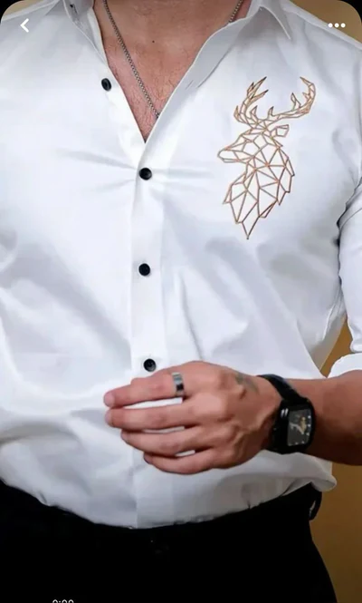

**1.# Premium Embroidered Shirts for Men in India | Designer Embroidery Fashion by Tailoes****

## Introduction

Premium embroidered shirts for men are becoming one of the strongest fashion trends in India because they combine craftsmanship, statement styling, and modern tailoring. Unlike basic printed shirts, embroidered shirts add texture, depth, and luxury appeal while remaining wearable for festive events, parties, vacations, and smart casual dressing.

Modern buyers are increasingly choosing embroidery fashion because it creates individuality without appearing excessive. Tailoes focuses on personalized menswear experiences that combine embroidery craftsmanship with modern fashion styling.

---

## What Are the Best Embroidered Shirts?

The best embroidered shirts are those that balance:

- Premium fabric quality  
- Clean embroidery placement  
- Breathable comfort  
- Versatile styling options  

Modern embroidered shirts work across:
- Festive wear  
- Casual outfits  
- Semi-formal styling  

---

## Key Takeaways

- Premium embroidered shirts for men are growing in modern Indian fashion  
- Embroidery adds texture and luxury compared to printed shirts  
- Designer embroidery shirts combine modern tailoring with craftsmanship  
- Premium embroidery shirts work for festive and casual styling  
- Breathable fabrics improve comfort and usability  
- Luxury embroidered shirts are trending among young buyers  

---

## Why Embroidered Shirts Are Trending in India

Indian menswear is shifting toward personalized, expressive, and premium fashion.

Consumers now prefer:
- Unique styling over basic clothing  
- Craftsmanship over fast fashion  
- Versatile outfits for multiple occasions  

Embroidery fits perfectly into this shift by adding artistic detailing without making outfits too loud.

---

## What Makes an Embroidered Shirt Premium?

A premium embroidered shirt includes:

- Breathable cotton or linen fabrics  
- Balanced embroidery placement  
- Clean stitching quality  
- Comfortable tailoring  
- Modern fit structure  
- Versatile styling design  

---

## Popular Embroidered Shirt Styles

### Minimal Embroidery Shirts
Subtle detailing on collars, chest, or sleeves. Ideal for daily premium wear.

### Statement Embroidery Shirts
Bold embroidery patterns for parties and festive occasions.

### Floral Embroidery Shirts
Nature-inspired embroidery for modern casual and vacation styling.

### Fusion Embroidery Shirts
Blend of Indian craftsmanship with modern silhouettes.

---

## Styling Guide

### Casual Styling
Pair with chinos, relaxed trousers, or jeans.

### Festive Styling
Pair with tailored trousers and loafers.

### Travel Styling
Lightweight embroidered shirts with breathable fabrics work best.

---

## Comparison Table

| Feature | Embroidered Shirts | Printed Shirts |
|----------|------------------|----------------|
| Texture | Raised embroidery | Flat print |
| Luxury Feel | High | Medium |
| Durability | Long-lasting | Fades over time |
| Styling | Versatile | Casual only |
| Fashion Impact | Premium | Basic |

---

## Benefits of Embroidered Shirts

- Premium appearance  
- Versatile styling options  
- Unique personal identity  
- Long-term fashion value  
- Suitable for multiple occasions  

---

## Common Mistakes

- Choosing overly heavy embroidery  
- Ignoring fabric comfort  
- Overstyling outfits  
- Selecting poor fit sizes  

---

## Expert Insight

Modern menswear is moving toward craftsmanship and subtle luxury instead of loud branding.

Embroidery is becoming a key part of this shift because it adds depth, texture, and individuality while remaining wearable.

Tailoes focuses on this modern direction by blending embroidery craftsmanship with clean tailoring.

---

## FAQ

### Are embroidered shirts suitable for casual wear?
Yes, minimal embroidery shirts are perfect for casual and smart casual outfits.

### What fabric is best for embroidered shirts?
Cotton and linen are the most comfortable and breathable options.

### Are embroidered shirts trending in India?
Yes, embroidery fashion is growing rapidly in modern menswear.

### How should embroidered shirts be styled?
Pair with neutral trousers and minimal accessories.

---

## Conclusion

Premium embroidered shirts for men are redefining modern fashion by combining craftsmanship, comfort, and versatility.

With growing demand for personalized menswear, embroidery continues to be one of the strongest fashion trends in India.

Tailoes delivers modern embroidered fashion that blends tradition with contemporary styling for today’s wardrobe needs.

