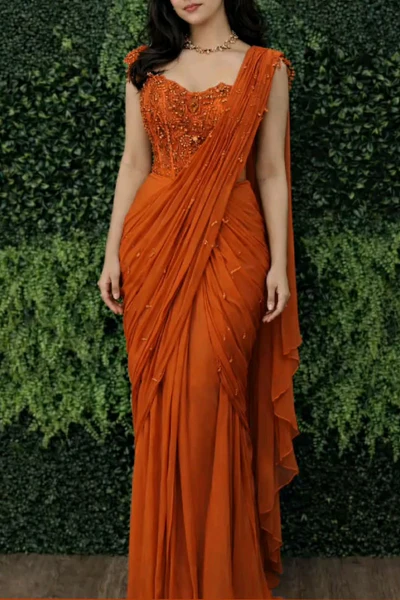

# Professional Women Tailoring in Bangalore for Perfect Fit Designer Outfits

Finding the right tailoring service is important for achieving comfort, confidence, and a polished appearance. Many women today prefer professional women tailoring in Bangalore because custom stitching provides a better fit than ready-made clothing.

Modern fashion trends focus heavily on personalization, especially for ethnic wear, office wear, occasion outfits, and designer clothing. This has increased demand for designer outfit stitching for women that combines style with precise measurements.

Services from Tailoes are designed to simplify the tailoring process through consultation-based stitching solutions that focus on comfort, fitting, and personalized styling preferences.

## Quick Answer

Professional women tailoring in Bangalore helps create customized outfits that fit properly, improve comfort, and match individual style preferences.

## Key Takeaways

- Custom tailoring improves outfit fitting
- Designer stitching supports personalization
- Consultation-based services improve accuracy
- Tailored outfits improve comfort
- Customized stitching supports modern fashion

## Why Professional Women Tailoring Is Growing

The demand for personalized fashion continues to increase because women now prefer outfits designed according to their measurements and styling preferences.

Customized tailoring supports:
- Better comfort
- Improved fitting
- Elegant appearance
- Long-term usability

## Benefits of Custom Tailoring

### Better Outfit Fitting

Customized stitching improves fitting around shoulders, waist, sleeves, and garment structure.

### Personalized Styling

Women can customize:
- Sleeve patterns
- Neck designs
- Outfit length
- Garment structure

### Improved Comfort

Professionally stitched outfits support natural movement and long-hour comfort.

## Professional Tailoring vs Ready-Made Clothing

| Feature | Professional Tailoring | Ready-Made Clothing |
|---|---|---|
| Fit | Customized | Standard sizing |
| Comfort | High | Moderate |
| Customization | Full personalization | Limited |
| Styling | Flexible | Pre-designed |

## Popular Customized Outfits

- Designer blouses
- Salwar suits
- Kurtis
- Office wear
- Gowns
- Festive outfits

## Conclusion

Professional tailoring continues to become an important part of modern women’s fashion because it improves fitting, comfort, and personalization.

Tailoes provides consultation-based women tailoring solutions designed for elegant, comfortable, and customized outfit stitching.

## FAQ

### Why is custom tailoring better?

Custom tailoring provides better fitting, comfort, and personalized styling.

### Are customized outfits suitable for office wear?

Yes. Professionally stitched office wear improves comfort and appearance.

### What outfits can be customized?

Blouses, kurtis, gowns, salwar suits, office wear, and festive outfits.
