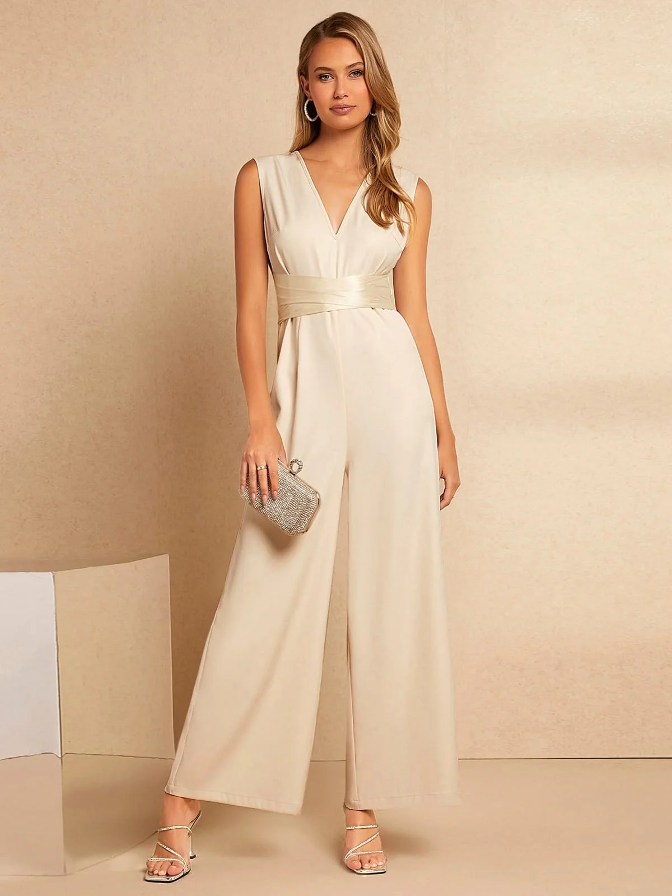

# Women Clothing Alteration, Repair & Perfect Fit Tailoring Services | Tailoes Doorstep Experts

## Introduction

Women clothing alteration services have become essential in modern fashion as people look for better fit, comfort, and personalized styling. With rising demand for **women clothing alteration services Bangalore**, Tailoes provides professional doorstep tailoring solutions that ensure precision, convenience, and high-quality finishing.

Through **women garment alteration service at home**, customers can now get expert tailoring without visiting shops, making the entire process simple, fast, and reliable.

---

## Quick Overview

Tailoes offers professional alteration, repair, and refitting services for women’s clothing, ensuring perfect fit and improved garment quality through doorstep tailoring experts.

---

## Key Highlights

- Doorstep tailoring convenience
- Accurate body-based measurements
- Professional garment repair services
- Perfect fit adjustments for all outfits
- Time-saving home service

---

## Women Clothing Alteration Services Explained

Women clothing alteration involves modifying garments to improve fit, style, and comfort. Tailoes focuses on delivering high-quality adjustments through expert tailoring techniques.

Services include:
- Length adjustments
- Waist and side fitting
- Sleeve corrections
- Shoulder reshaping
- Full garment refitting

---

## Doorstep Tailoring Services for Women

With **doorstep tailoring services for women Bangalore**, Tailoes brings professional tailoring directly to your home.

This includes:
- Home measurement sessions
- Fabric evaluation
- On-site consultation
- Personalized fitting adjustments

---

## Why Perfect Fit Matters

A perfect fit improves:
- Comfort during daily wear
- Overall appearance
- Confidence and posture
- Long-term garment usability

That is why **perfect fit tailoring services for women** are becoming highly preferred in urban fashion needs.

---

## Women Dress Alteration and Repair Service

Tailoes provides complete **women dress alteration and repair service**, covering:

- Casual dresses
- Office wear
- Ethnic outfits
- Party wear

Even damaged or loose garments can be restored professionally.

---

## Comparison: Tailoes vs Regular Tailoring

| Feature | Tailoes Service | Regular Tailoring |
|--------|----------------|------------------|
| Service Type | Doorstep service | Shop visit required |
| Accuracy | High precision | Basic measurement |
| Convenience | At home | Travel needed |
| Customization | Fully personalized | Limited adjustments |

---

## Benefits of Tailoes Services

- Saves time and travel effort
- Better fitting accuracy
- Professional finishing quality
- Long-lasting garment usage
- Comfortable doorstep experience

---

## Common Use Cases

- Office wear fitting adjustments
- Ethnic wear resizing
- Dress alterations after weight changes
- Repairing damaged garments

---

## FAQ

### Can all types of women’s clothes be altered?
Yes, dresses, tops, ethnic wear, and office wear can all be professionally altered.

### Is doorstep tailoring available in Bangalore?
Yes, Tailoes provides full doorstep tailoring services across Bangalore.

### Can old clothes be repaired instead of replaced?
Yes, garments can be repaired and refitted for better usability.

### How long does alteration take?
Time depends on the garment type and level of adjustment required.

---

## Conclusion

Tailoes delivers reliable and professional women clothing alteration services in Bangalore with doorstep convenience. From repair to perfect fitting, every service is designed to improve comfort, style, and garment life.

With expert tailoring and modern doorstep service, Tailoes ensures every outfit fits perfectly and looks its best.

## Blog

https://tailoes.com/blogs/news/women-clothing-alteration-repair-perfect-fit-tailoring-services-tailoes-doorstep-experts

