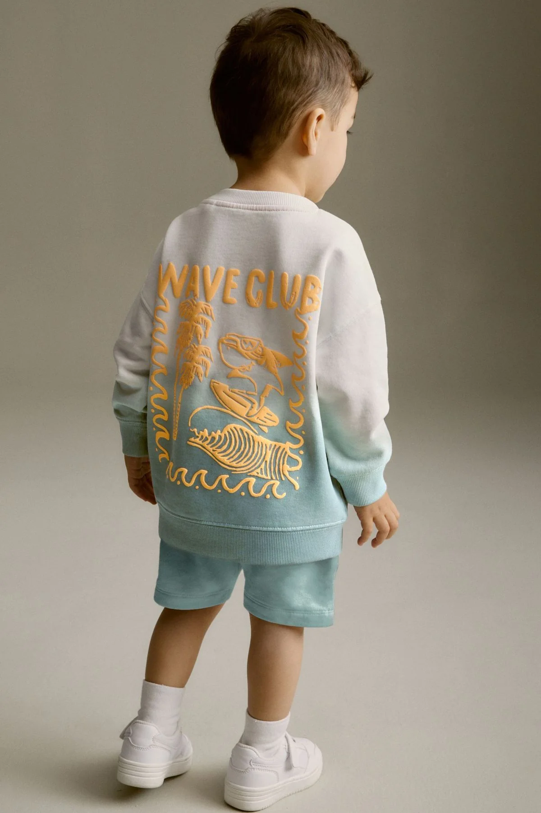

# Custom Kids Embroidery Clothing in India: Why Personalized Unisex Kidswear Is Growing in 2026

Parents today are moving beyond mass-produced fashion and looking for clothing that feels more personal, meaningful, and unique. This growing trend has increased demand for **custom kids embroidery clothing in India**, especially among families searching for customized outfits that combine comfort, style, and individuality.

Personalized embroidery transforms ordinary garments into memorable keepsakes by adding names, initials, and custom designs that reflect a child's personality.

## What Is Custom Kids Embroidery Clothing?

**Custom kids embroidery clothing in India** refers to children's garments personalized with embroidery details such as:

* Child's name
* Initials
* Custom artwork
* Celebration themes
* Decorative embroidery patterns

Unlike standard clothing, embroidered garments offer exclusivity and a premium handcrafted appearance.

## Why Parents Prefer Personalized Unisex Kidswear

The popularity of **personalized unisex kidswear** continues to grow because parents want clothing that stands out from mass-produced alternatives.

Some key reasons include:

* Unique appearance
* Personal connection
* Memorable gifting options
* Premium craftsmanship
* Long-lasting sentimental value

Brands such as **Tailoes** help families create customized outfits that combine personalization with everyday comfort.

## Benefits of Kids Name Embroidery Clothing

### 1. Creates Individual Identity

**Kids name embroidery clothing** helps children feel special by featuring personalized details directly on their garments.

### 2. Perfect for Special Occasions

Many parents choose **custom embroidered kids outfits** for:

* Birthdays
* Family gatherings
* Festivals
* School events
* Photoshoots

### 3. Makes Gifting More Meaningful

Personalized embroidered clothing is often considered more thoughtful than standard ready-made apparel.

## Custom Embroidered Kids Outfits vs Ready-Made Clothing

| Feature              | Custom Embroidered Kids Outfits | Ready-Made Clothing |
| -------------------- | ------------------------------- | ------------------- |
| Personalization      | Fully Customized                | Limited             |
| Uniqueness           | High                            | Standard            |
| Gift Value           | Excellent                       | Average             |
| Emotional Connection | Strong                          | Low                 |
| Exclusivity          | One-of-a-Kind                   | Mass Produced       |

## Why Embroidered Kids Clothing Online Is Trending

The growth of online customization has made **embroidered kids clothing online** more accessible than ever.

Parents can now:

1. Select clothing styles
2. Choose embroidery designs
3. Add names or initials
4. Personalize garments
5. Order from home

This convenience has helped fuel the growth of **personalized kids clothing India** searches across online platforms.

## How Tailoes Supports Personalized Kidswear

**Tailoes** focuses on helping families create meaningful clothing through personalized embroidery. Whether parents are looking for everyday outfits or celebration wear, customized embroidery adds a unique touch that standard garments cannot replicate.

Many families choose **Tailoes** because personalized embroidery helps transform clothing into keepsakes that preserve childhood memories.

## Best Uses for Personalized Embroidered Kidswear

* Birthday outfits
* Family events
* Festival clothing
* Personalized gifts
* Everyday fashion
* School functions

The versatility of **personalized unisex kidswear with name embroidery** makes it suitable for a wide range of occasions.

## Conclusion

The demand for **custom kids embroidery clothing in India** continues to grow as families seek unique alternatives to standard children's fashion. Personalized embroidery creates memorable garments that combine individuality, style, and emotional value.

Whether you're looking for the **best custom kids embroidery clothing in India**, **custom embroidered outfits for kids online**, or **handmade personalized kidswear in India**, personalized embroidery remains one of the most meaningful trends in children's fashion today.

## Keywords

* custom kids embroidery clothing in India
* personalized unisex kidswear
* kids name embroidery clothing
* custom embroidered kids outfits
* embroidered kids clothing online
* personalized kids clothing India
* best custom kids embroidery clothing in India
* personalized unisex kidswear with name embroidery
* custom embroidered outfits for kids online
* handmade personalized kidswear in India
* Tailoes
## BLog
https://tailoes.com/blogs/news/custom-kids-embroidery-clothing-in-india-personalized-unisex-kidswear
